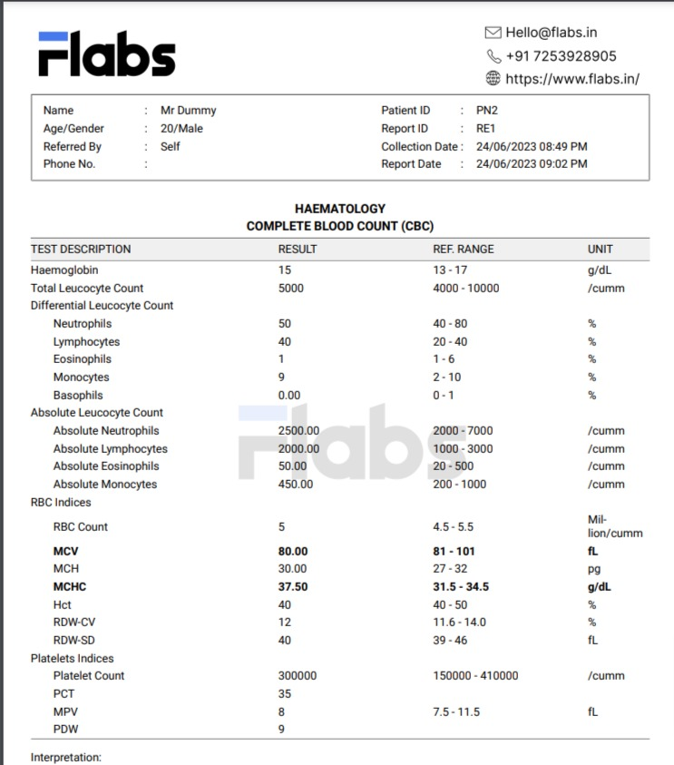

# Oculus Rift Healthcare AI

*Revolutionary AI-powered healthcare companion transforming medical diagnostics and patient care*

## 🚀 Project Overview

Oculus Rift Healthcare AI is a cutting-edge healthcare solution that democratizes access to advanced medical diagnostics through artificial intelligence. Our platform bridges the gap between complex medical technology and accessible healthcare, especially in underserved communities where specialist care is limited.

**🎯 Mission:** Making world-class medical diagnostics accessible to everyone, everywhere.

**🌟 Vision:** Empowering healthcare providers with AI-driven insights for better patient outcomes.

---

## ✨ Key Features & Capabilities

### 🔬 Advanced Medical Image Analysis
Our AI models can analyze and detect various medical conditions with high accuracy:

- **🧠 Brain Tumor Detection** - Advanced MRI scan analysis using deep learning
- **👁️ Diabetic Retinopathy Screening** - Early detection through retinal image analysis
- **🦴 Bone Fracture Detection** - X-ray analysis for fracture identification
- **🫁 Lung Cancer Screening** - Chest X-ray analysis for early cancer detection
- **🩺 Skin Disease Analysis** - Dermatological condition identification
- **💔 Heart Disease Prediction** - Cardiac risk assessment using ML algorithms
- **🦷 Oral Health Analysis** - Ulcer and tongue condition detection
- **💅 Nail Disease Detection** - Comprehensive nail health assessment

### 🏥 Dual Interface System

#### 👥 Patient Portal
- **Self-Service Analysis** - Upload medical images for instant AI analysis
- **Personalized Health Insights** - Tailored recommendations based on analysis
- **Health Tracking** - Monitor health parameters over time
- **Educational Resources** - Learn about medical conditions and treatments

#### 👨‍⚕️ Doctor Dashboard
- **Patient Management** - Comprehensive patient records and history
- **Analysis Review** - Validate and approve AI-generated reports
- **Report Generation** - Professional PDF medical reports
- **Collaboration Tools** - Share insights with medical teams

### 🤖 AI-Powered Features

- **💬 Medical Chat Assistant** - Natural language medical query support
- **🌍 Multi-Language Support** - Accessible in multiple languages
- **🗣️ Voice Integration** - Text-to-speech and speech-to-text capabilities
- **📍 Hospital Locator** - Find nearby healthcare facilities with maps integration
- **📊 Google Fit Integration** - Real-time health data synchronization
- **🌙 Dark Mode Support** - Enhanced user experience with multiple themes

---

## 🎯 Use Cases & Applications

### 🏥 Rural Healthcare Centers
Transform rural clinics with AI-powered diagnostic capabilities:
- Instant preliminary screening when specialists aren't available
- Reduce patient travel time and costs
- Enable early detection of critical conditions
- Support healthcare workers with AI-driven insights

### 🎓 Medical Education & Training
Enhance medical education with interactive AI tools:
- Training platform for medical interns and students
- Practice recognizing medical conditions in images
- Validate preliminary diagnoses with AI assistance
- Build confidence in diagnostic skills

### 👨‍⚕️ Healthcare Professionals
Empower doctors and nurses with advanced tools:
- Second opinion support for complex cases
- Standardize diagnostic processes
- Reduce diagnostic errors through AI validation
- Streamline patient workflow and documentation

### 🏠 Home Healthcare & Telemedicine
Bring medical expertise to patients' homes:
- Remote patient monitoring and analysis
- Preliminary health screenings at home
- Reduce unnecessary hospital visits
- Enable proactive healthcare management

---

## 🖼️ Sample Test Images & Analysis

Our platform includes comprehensive test datasets for demonstration:

### Brain Analysis

*MRI scan analysis for tumor detection and brain health assessment*

### Eye Health Screening

*Retinal image analysis for diabetic retinopathy detection*

### Skin Condition Detection

*Dermatological condition identification and skin health assessment*

### Lung Health Screening

*Chest X-ray analysis for respiratory health and cancer screening*

### Blood Report Analysis

*Automated blood report interpretation and analysis*

*All test images are provided for demonstration purposes and educational use only*

---

## 📊 Technology Stack & Innovation

### 🧠 Artificial Intelligence
- **Computer Vision:** YOLO and custom CNN models for medical image analysis
- **Natural Language Processing:** Google Gemini for medical chat assistance
- **Machine Learning:** Scikit-learn for predictive health modeling
- **Deep Learning:** PyTorch for advanced neural network implementations

### 🖥️ User Experience
- **Frontend:** Streamlit for intuitive, responsive interface design
- **Real-time Processing:** Instant analysis and feedback
- **Cloud Integration:** Scalable deployment on modern cloud platforms
- **Mobile Responsive:** Accessible across all device types

### 🔒 Security & Compliance
- **Data Protection:** Secure handling of sensitive medical information
- **User Authentication:** Role-based access control system
- **Privacy First:** HIPAA-compliant data management practices
- **Encrypted Storage:** Secure database management with Supabase

---

## 🌟 Impact & Benefits

### 🎯 For Patients
- **Faster Diagnosis:** Instant preliminary analysis of medical images
- **Cost Effective:** Reduce expensive specialist consultations
- **Accessible Care:** Available 24/7 from anywhere
- **Health Education:** Learn about conditions and treatments
- **Peace of Mind:** Early detection and monitoring capabilities

### 🏥 For Healthcare Providers
- **Enhanced Accuracy:** AI-assisted diagnostic validation
- **Improved Efficiency:** Streamlined workflow and documentation
- **Professional Development:** Continuous learning with AI insights
- **Resource Optimization:** Better allocation of specialist time
- **Quality Assurance:** Standardized diagnostic processes

### 🌍 For Healthcare Systems
- **Scalable Solutions:** Serve more patients with existing resources
- **Reduced Costs:** Lower healthcare delivery expenses
- **Improved Outcomes:** Earlier detection leads to better treatment
- **Data Insights:** Population health analytics and trends
- **Innovation Driver:** Advancing healthcare technology adoption

---

## 🔮 Future Roadmap

### 📈 Upcoming Features
- **🧬 Genetic Analysis Integration** - Personalized medicine based on genetic data
- **📱 Mobile Applications** - Native iOS and Android apps
- **🤝 EHR Integration** - Seamless electronic health record connectivity
- **📊 Advanced Analytics** - Population health insights and predictive modeling
- **🌐 Global Language Expansion** - Support for 50+ languages

### 🚀 Innovation Pipeline
- **Augmented Reality Visualization** - 3D medical image exploration
- **IoT Device Integration** - Connect with wearable health devices
- **Blockchain Health Records** - Secure, decentralized patient data
- **AI-Powered Drug Discovery** - Accelerate pharmaceutical research
- **Robotic Surgery Integration** - AI guidance for surgical procedures

---

## 🏆 Awards & Recognition

*Building the future of healthcare technology with AI innovation*

- 🥇 **Innovation Excellence** - Healthcare Technology Leadership
- 🌟 **Impact Award** - Improving healthcare accessibility
- 🏅 **AI Excellence** - Advanced medical image analysis
- 🎯 **User Experience** - Intuitive healthcare interface design

---

## 🤝 Community & Collaboration

Join our mission to revolutionize healthcare through AI:

- **🌍 Global Impact:** Contributing to worldwide healthcare improvement
- **🎓 Educational Partnerships:** Collaborating with medical institutions
- **🔬 Research Collaboration:** Advancing medical AI research
- **💡 Open Innovation:** Fostering healthcare technology development

---

## ⚖️ Medical Disclaimer

**Important Notice:** Oculus Rift Healthcare AI is designed as a diagnostic support tool and educational platform. All analysis results are preliminary and must be validated by qualified healthcare professionals. This platform does not replace professional medical advice, diagnosis, or treatment. Always consult with licensed medical practitioners for healthcare decisions.

---

## 📧 Contact & Support

**Email:** care@oculusrifthealthcare.com  
**Website:** www.oculusrifthealthcare.com  
**Phone:** +91-1234567890

*Transforming healthcare through AI innovation - One diagnosis at a time* 🚀

---

*© 2024 Oculus Rift Healthcare AI. All rights reserved.*
